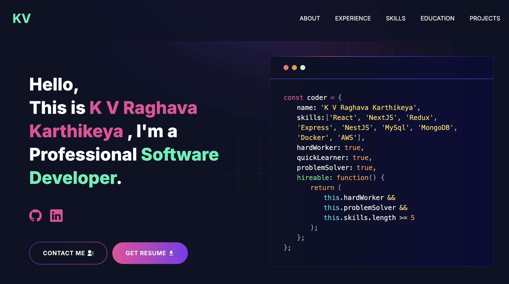

# ⚡ Professional Developer Portfolio

A modern, high-performance developer portfolio website built with **Next.js** and **Tailwind CSS**. This project features a responsive design, dynamic project showcases, and a custom 3D-concept hero section.

 

## 🚀 Features

- **🎨 Modern UI/UX:** Clean, dark-themed design with custom gradients and glassmorphism effects.
- **📱 Fully Responsive:** Optimized for all devices (Mobile, Tablet, Desktop).
- **✨ Hero Section:** Full-screen immersive background with transparency effects.
- **📂 Dynamic Project Showcase:** Letterboxed, non-cropped project previews with "View Project" overlays.
- **⚡ High Performance:** Built on Next.js 13+ App Router for server-side rendering and speed.
- **🛠 Tech Stack Display:** Visual representation of skills and tools.
- **📫 Contact Integration:** direct links to social profiles and resume download.

## 🛠️ Tech Stack

- **Framework:** [Next.js](https://nextjs.org/) (React)
- **Styling:** [Tailwind CSS](https://tailwindcss.com/)
- **Icons:** [React Icons](https://react-icons.github.io/react-icons/)
- **Animations:** CSS Transitions & Hover Effects
- **Deployment:** Vercel / Cloudflare Pages

## 📂 Project Structure

```bash
├── app/
│   ├── components/      # Reusable UI components (Hero, Projects, Navbar)
│   ├── projects/        # Dynamic project details pages ([slug])
│   ├── layout.js        # Main site wrapper (Global font, metadata)
│   ├── page.js          # Homepage entry point
│   └── globals.css      # Global styles (Tailwind directives)
├── public/
│   ├── image/           # Static assets (Backgrounds, Project screenshots)
│   └── resume.pdf       # Downloadable resume file
└── utils/
    └── data/            # Static data files (Project lists, Personal info)
